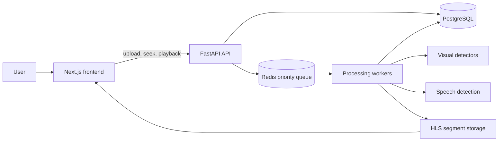
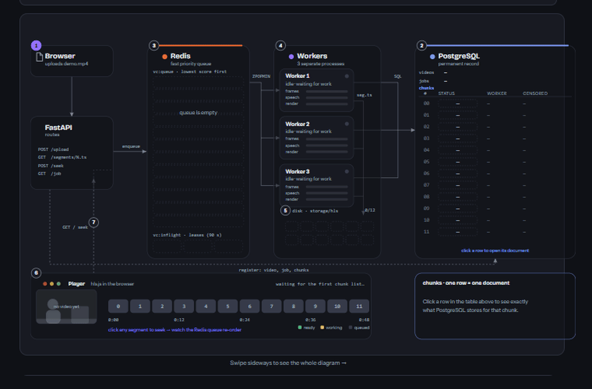

# CensorNet

## Safer video, streamed sooner

CensorNet is a real-time video censorship platform. A user uploads a video or provides a
YouTube URL, and CensorNet begins preparing a safer HLS stream instead of waiting for the
whole video to finish processing.

The system divides a video into short chunks, detects sensitive visual and spoken content,
applies targeted censorship, and prioritizes the chunks closest to the viewer's current
playback position. This allows a user to start watching while the rest of the video is still
being processed.

## What a user can do

- Upload an MP4 video or submit a YouTube URL.
- Start watching as soon as the first processed segment is available.
- Jump to another point in the timeline and have that part prioritized.
- See the processing status of every chunk.
- Review what was detected, including labels, timestamps, bounding boxes, and beeped words.
- Play a stream where visual detections are blurred and detected profanity is replaced with a beep.

## Why it matters

### For viewers

Long videos do not need to be fully processed before playback begins. CensorNet follows the
viewer: if the viewer seeks to a different scene, the processing queue gives that scene
priority. The result is a safer viewing experience with less waiting and more control.

### For product and business teams

CensorNet demonstrates a practical foundation for a video-safety product:

- **Lower time to first playback:** process and serve the first required segments early.
- **Targeted moderation:** blur detected regions instead of obscuring an entire frame whenever possible.
- **Demand-aware compute:** use playback position and seeks to decide what should be processed next.
- **Auditable decisions:** store detections, audio events, processing attempts, and worker information.
- **Resilient processing:** Redis coordinates work, while PostgreSQL remains the source of permanent records.
- **Extensible moderation policy:** detectors, thresholds, profanity lists, and processing priorities are configurable.

## Censorship pipeline

| Input | Detection or processing | Output |
| --- | --- | --- |
| Video frames | NudeNet for nudity, YOLO for weapons, and red-region analysis gated by a violence classifier for blood | Blur only the detected visual regions |
| Audio | faster-Whisper transcription with the configured English and Hindi/Hinglish profanity list | Replace matching words with a beep |
| Playback request | HLS playlist and segment availability check | Boost the requested chunk so it is processed next |

The default chunk lifecycle is:

```text
pending -> processing -> completed
                    \-> failed
```

Each chunk is decoded, analyzed, rendered, encoded as an MPEG-TS HLS segment, and recorded
in PostgreSQL. A failed chunk is not served uncensored; after the configured retry limit it
returns an error until it is retried.

## System architecture



### Frontend architecture animation

The architecture above is also implemented as an interactive frontend animation. The preview
below is captured from the current Next.js frontend:

[](v2/frontend/app/architecture/page.tsx)

Open the full interactive version at `/architecture` when running the frontend locally. It
shows the same flow in motion: upload, chunk creation, Redis prioritization, worker processing,
PostgreSQL records, HLS delivery, and reprioritization after a seek. The animation is a
deterministic frontend simulation for explaining the system; it does not replace the live
backend pipeline.

### Responsibilities

- **Next.js frontend:** upload flow, job status, HLS playback, chunk progress, and the interactive architecture visualization.
- **FastAPI backend:** upload and YouTube ingestion, job lifecycle, HLS playlists and segments, seek handling, and operational endpoints.
- **Redis:** disposable priority queue, worker leases, and worker heartbeats.
- **PostgreSQL:** permanent records for videos, jobs, chunks, detections, audio events, attempts, and processing times.
- **Workers:** load the detection models once and process chunks independently.
- **FFmpeg and storage:** extract frames/audio and write completed HLS segments atomically.

Redis is intentionally disposable. If it is cleared, the reaper can rebuild pending work from
PostgreSQL. PostgreSQL is the durable record of what happened.

## Frontend architecture animation

The frontend includes a live, deterministic explanation of the pipeline:

- The homepage shows a read-only animation that starts automatically at `1x`.
- `/architecture` provides the full interactive version with play/pause, restart, speed controls,
  timeline seeking, PostgreSQL row inspection, priority information, and an event log.
- Moving packets represent simulated upload, queue, worker, database, and playback events.
- The animation has one moving block per packet and no ghost/trail copies.
- The simulation pauses when it is off-screen, when the browser tab is hidden, or when the user pauses it.
- It respects `prefers-reduced-motion`.

The animation is a frontend explanation of the backend design; it does not process a real
uploaded video. Open it locally after starting the frontend:

```text
http://localhost:3000/architecture
```

The simulation is implemented in `v2/frontend/lib/arch/engine.ts` and
`v2/frontend/lib/arch/useSimulation.ts`. The SVG diagram and packet layer are under
`v2/frontend/components/architecture/`.

## Repository structure

```text
CensorNet/
├─ v2/                         Current full-stack implementation
│  ├─ backend/
│  │  ├─ app/
│  │  │  ├─ models/            SQLAlchemy database models
│  │  │  ├─ routes/            Video, job, and chunk API routes
│  │  │  ├─ schemas/           Pydantic request/response schemas
│  │  │  ├─ services/          Queue, detection, audio, rendering, and storage logic
│  │  │  └─ workers/            Worker process entry point
│  │  ├─ tests/                Backend tests
│  │  ├─ requirements.txt      Python dependencies
│  │  └─ run_workers.py        Start workers in one terminal
│  ├─ frontend/
│  │  ├─ app/                  Next.js routes and global styles
│  │  ├─ components/
│  │  │  ├─ architecture/     Interactive architecture visualization
│  │  │  ├─ home/              Homepage sections and animation preview
│  │  │  ├─ layout/            Navigation and footer
│  │  │  ├─ upload/            File and YouTube input components
│  │  │  └─ video/             Player, buffer, job, and chunk components
│  │  └─ lib/                  API client, status helpers, and simulation engine
│  ├─ docker-compose.yml       PostgreSQL and Redis
│  └─ README.md                Detailed v2 operational notes
└─ v1/                         Earlier frontend/backend implementation
```

## Local setup

### Requirements

- Python 3.10+
- Node.js 18+
- FFmpeg and FFprobe available on `PATH`
- Docker Desktop
- Enough memory for the selected detection models and worker count

### 1. Start PostgreSQL and Redis

From `v2/`:

```powershell
docker compose up -d
```

### 2. Install and configure the backend

```powershell
cd v2\backend
python -m venv .venv
.\.venv\Scripts\Activate.ps1
pip install -r requirements.txt
copy .env.example .env
python check_setup.py
```

The first worker startup may download the configured Whisper, YOLO, and violence-classifier
models. For GPU deployments, install the matching CUDA build of PyTorch and configure
`DEVICE=cuda` in `backend/.env`.

### 3. Install and run the frontend

In a separate terminal:

```powershell
cd v2\frontend
npm install
npm run dev
```

### 4. Run the API and workers

In terminals with the backend virtual environment active:

```powershell
cd v2\backend
uvicorn app.main:app --port 8000
```

```powershell
cd v2\backend
python run_workers.py -n 3
```

Open `http://localhost:3000`, upload a video, and open the generated video page. The API
health endpoint is available at `http://localhost:8000/health`.

## Operational model

Chunks nearer to the playhead receive higher priority:

| Priority tier | Purpose |
| --- | --- |
| `STALL` | The exact segment currently blocking playback |
| `URGENT` | The playhead chunk and the configured prefetch window |
| `AHEAD` | Future chunks, ordered nearest first |
| `BEHIND` | Previously watched chunks, useful when the viewer seeks back |

Workers claim chunks atomically in PostgreSQL after taking work from Redis, preventing two
workers from processing the same chunk. Leases and heartbeats allow abandoned work to be
requeued when a worker stops unexpectedly.

## Testing

Backend tests:

```powershell
cd v2\backend
pytest -q
```

Frontend production build:

```powershell
cd v2\frontend
npm run build
```

## Configuration

Important backend settings are documented in `v2/backend/.env.example`. Common tuning points
include:

- `ANALYZER`: enabled visual and audio analyzers.
- `CHUNK_SECONDS`: chunk duration and seek granularity.
- `ANALYSIS_FPS`: visual sampling rate.
- detector thresholds: control sensitivity and false positives.
- `WHISPER_MODEL`: speech-recognition model size.
- `PREFETCH_CHUNKS`: how much work is prepared ahead of the playhead.
- `WORKER_COUNT` and lease settings: processing capacity and recovery behavior.

## Current scope

CensorNet currently processes uploaded videos and YouTube sources. It does not ingest a live
RTMP or camera feed. The chunk, queue, and worker design can be extended to support live
sources later.